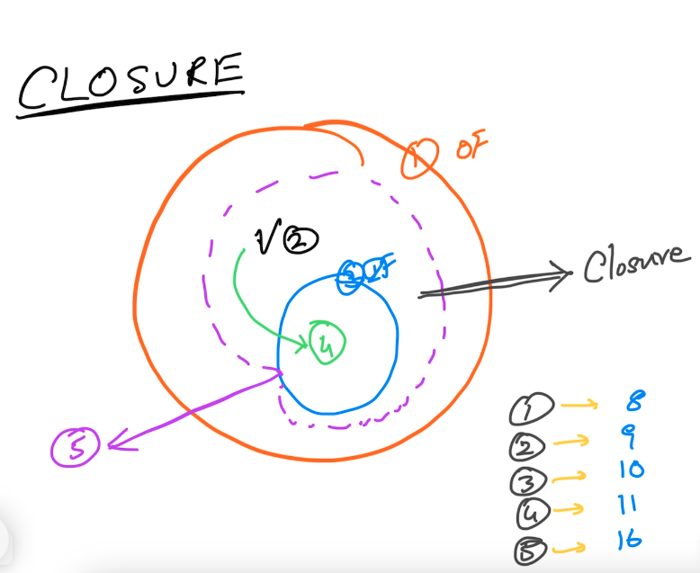

# JavaScript (ES5)
## Data Types
- String
- Number
- Boolean
- Object
- Function
- Undefined
## Programming Constructs
- var, if else, switch case, while, for, try catch finally, throw, function
## APIs
- Array, Math, Regex, Error, setTimeout, clearTimeout, setInterval, clearInterval
## Other
- Loosely typed
- Dynamic
- Functional (Higher Order Functions)


## Higher Order Functions
### Creation
- Function Statement
```js
function fn(){
}
```
- Function Expression
```js
var fn = function fn(){
}
```
### Attributes
```js
fn['id'] = 100
console.log(fn.id)
```
### Methods
```js
fn['whoAmI'] = function(){
    console.log('I am a function');
}
fn.whoAmI()
```
### Functions as Arguments
```js
function fz(z){
    console.log('typeof z = ', typeof z);
}

fz(fn)
```
### Functions as return values
```js
function getAdder(){
    return function(x,y){
        return x + y;
    }
}

var adder = getAdder()

typeof adder

adder(100,200)

getAdder()(100,400)
```

## Object
## object literal

```js
var obj = {}
```

## object with attributes
```js
var emp = {
    id : 100,
    name : 'Magesh',
    salary : 10000
}```
## object with attributes & methods
```js
var product = {
    id : 100,
    name : 'Pen',
    cost : 10,
    applyDiscount : function(discount){
        this.cost = this.cost * ((100-discount)/100)
    }
}


console.log(product)

product.applyDiscount(10)

console.log(product)
```
## accessing attributes using '.' & '[]' notations
console.log(product.id)
console.log(product['id'])
## use the '.' notation when updating the value of an existing attribute
product.cost = 20
## use the '[]' notation when creating a new attribute
product['category'] = 'stationary'

## Iterating an object through its attributes
```js
// print the attribute names
for (var key in product){
    console.log(key)
}

// print the attribute names & its values
for (var key in product){
    console.log(key, product[key])
}
```

### Assignment
- Write a 'PrintAttrs' function that prints ONLY the name & value of the "properties" of the given object (omit the "methods")
```js
function printAttrs(o){
    for (var key in o){
        if (typeof o[key] !== 'function'){
            console.log(key, o[key])
        }
    }
}
```
## Array
```js
var nos = []
var nos = [3,1,4,2,5]
```
### using the indexer
```js
console.log(nos[0])
```
### count
```js
console.log(nos.length)
```
### iterating using indexer
```js
for (var idx = 0; idx < nos.length; idx++){
    console.log(nos[idx]);
}
```
### iteraing using for-of
```js
for(var no of nos){
    console.log(no)
}
```
### adding a new item
```js
nos.push(10)
```
### removing an item
```javascript
nos.pop()
```
### other useful methods
```javascript
nos = nos.concat(20,30,40)
```
### slice, splice, at, keys, values etc
### Assignment
- Write a 'GetAttrs' function that returns ONLY the name & value of the "properties" of the given object (omit the "methods") as an array

ex output: `[['id', 100],['name', 'pen'], ['cost', 10]]`
```js
function GetAttrs(o){
    var result = []
    for (var key in o){
        if (typeof o[key] !== 'function'){
            var attr = [ key, o[key]]
            result.push(attr)
        }
    }
    return result
}
```
## Function Invocation Patterns
### Important
`In JavaScript, it does not matter WHO owns the function or WHERE the function is. What matters is 'HOW' the function is invoked`

### 1. As a method of an object

`this -> obj`

```js
var emp = {
    name : 'Magesh'
}

function whoAmI(){
    console.log('I am ', this.name);
}
// make the function a method of emp
emp['whoAmI'] = whoAmI
emp.whoAmI()
// ================
var product = {
    name : 'Pen'
}
// make the function a method of product
product['whoAmI'] = whoAmI
product.whoAmI()
```

### 2. As a 'function'
`this -> global (window in the browser)`
```js
window.name = 'Chrome Browser'
whoAmI()
```

### 3. As an 'Immediately Invoked Function Expression' (IIFE)
```js
(function fn(){
    console.log('fn invoked');
})()

(function greet(userName){
    console.log('Hi ' + userName + ', Good Day!')
})('Magesh')

var result = (function add(x,y){
    return x + y;
})(100,200)
```
#### Using IIFE to create closures
##### Click Tracker (example)
[Source Code](./Day-01/clickTracker.html)


##### Assignment
```js
/* 
Create an object with the following methods and assign it to a variable 'spinner'

var spinner =  ..... 

- Methods
    - up()
    - down()
- behavior
    spinner.up() //=> 1
    spinner.up() //=> 2
    spinner.up() //=> 3
    spinner.up() //=> 4

    spinner.down() //=> 3
    spinner.down() //=> 2
    spinner.down() //=> 1
    spinner.down() //=> 0
    spinner.down() //=> -1
IMPORTANT
- Ensure that the outcome of up() and down() methods CANNOT be influenced from outside
    The following SHOULD NOT be possible
    ======
    window.counter = 10000
    spinner.up() //=> 10001
    ======
    spinner.counter = 10000
    spinner.up() //=> 10001
- No HTML, No DOM APIs, No UI
*/
// creating a Singleton using IIFE
// var spinner = (function(){
//     var counter = 0

//     function up(){
//         return ++counter;
//     }
//     function down(){
//         return --counter;
//     }
//     var spinner = {
//         up : up,
//         down : down
//     }
//     return spinner;
// })()
var spinner = (function(){
    var counter = 0;
    return {
        up : function(){
            return ++counter;
        },
        down : function(){
            return --counter;
        }
    }
})

// Factory
function spinnerFactory(){
    var counter = 0

    function up(){
        return ++counter;
    }
    function down(){
        return --counter;
    }
    var spinner = {
        up : up,
        down : down
    }
    return spinner;
}
```
